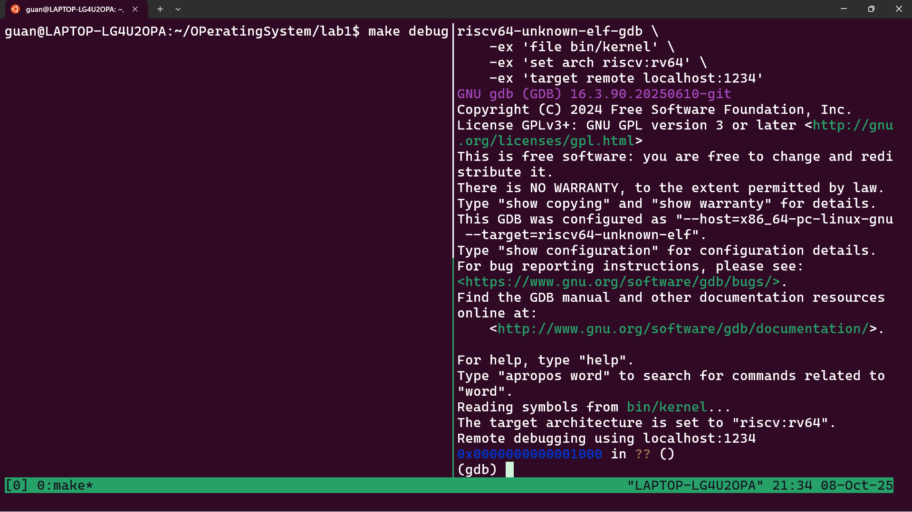
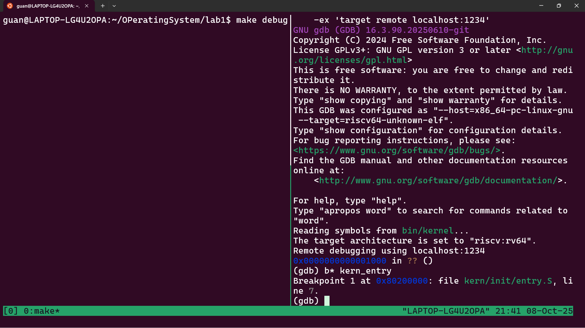
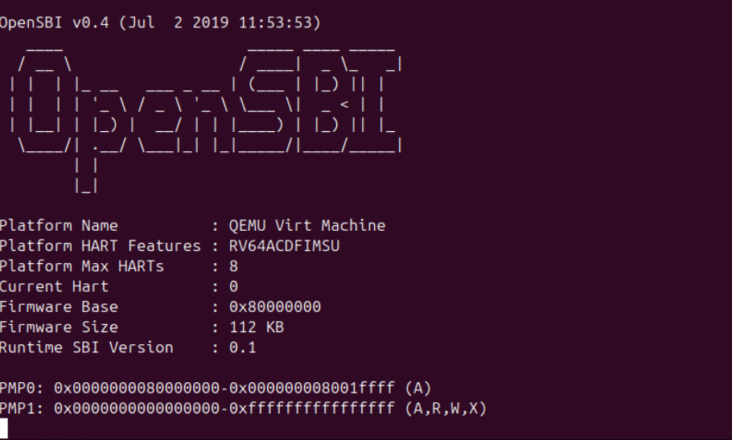
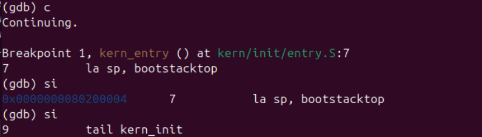
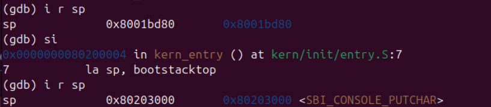
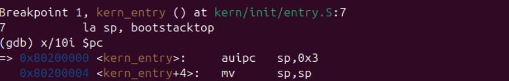
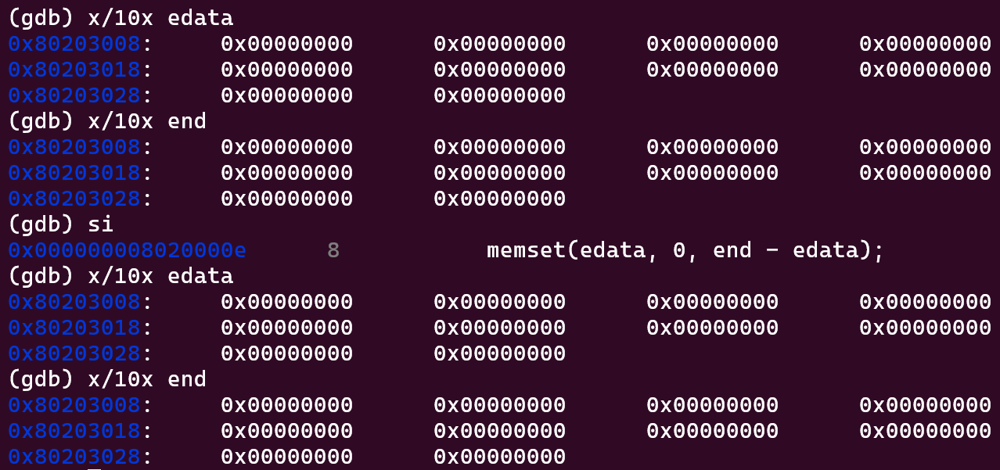
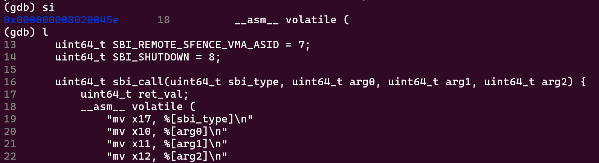
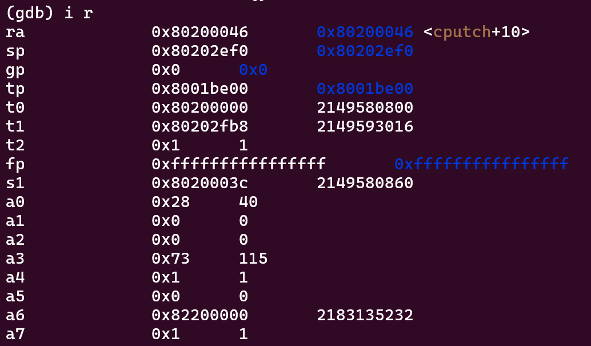
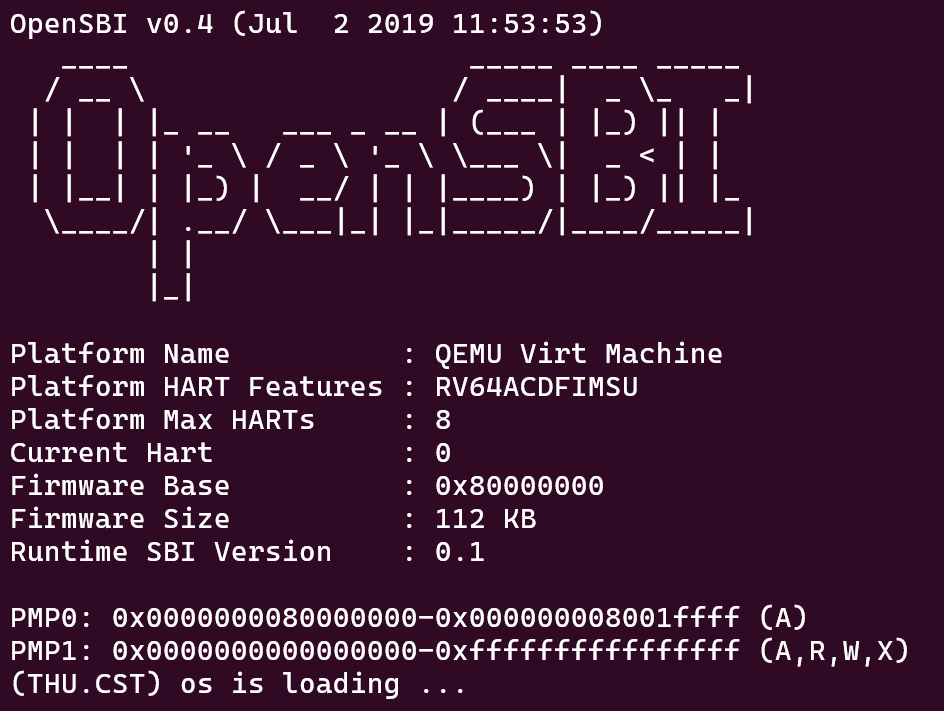

<h1 align="center">Ucore Lab 1 Report</h1>

## 一、理解内核启动中的程序入口操作

### 1. la sp, bootstacktop

这条指令在汇编中完成了一个​​加载地址（Load Address）​​ 的操作。
la是一个伪指令（Pseudo-instruction），它会被汇编器扩展成一条或多条实际的 RISC-V 指令（通常是 auipc和 addi的组合）。
它的功能是将符号 bootstacktop所代表的​​内存地址​​（而不是该地址里的数据）加载到寄存器 sp（Stack Pointer， 栈指针寄存器）中。
​​
目的是​​设置内核的栈空间（Stack）​​。
​​为C代码执行做准备​​：C语言的执行严重依赖于栈。所有局部变量、函数调用时的返回地址、函数参数等都存放在栈中。​​在没有设置好栈之前，是无法正常调用任何C函数的。​​ entry.S中的汇编代码是内核最先执行的代码，它的核心任务之一就是为运行C代码准备一个正确的运行时环境，其中最重要的一步就是设置栈指针。
​​指定栈的位置​​：bootstacktop是一个在汇编中定义（例如通过 .space指令）的标签，它指向一段预先分配好的内存区域（通常叫 bootstack）的​​顶部​​。栈在内存中通常是向下增长的（从高地址向低地址），所以将栈指针 sp设置为栈顶地址 bootstacktop，后续的压栈操作（push）就会正确地在这段安全的内存区域内进行。

### 2. tail kern_init

这条指令完成了一个​​尾调用（Tail Call）​​ 操作。
tail是 RISC-V 的一条跳转指令，类似于 j（jump），但它具有特殊的语义。
它​​跳转​​到 kern_init这个符号代表的地址（也就是你提供的 kern_initC 函数的起始地址）开始执行。

目的是​​跳转到C语言的主入口点，并且永不返回​​。
​​移交控制权​​：到执行 tail指令之前，内核启动的所有准备工作（如设置栈、可能还有关闭中断、初始化页表等）都已由汇编代码完成。tail kern_init是汇编启动代码的最后一条指令，它正式将CPU的执行控制权​​从汇编世界移交到C世界​​。从此，操作系统内核的主要逻辑将由高级语言C来编写。
​​尾调用的优化特性​​：使用 tail而不是 call（用于函数调用）是关键。
如果使用 call kern_init，汇编器会认为我们​​还需要返回​​，因此它会将 call指令后的下一条指令地址（返回地址）压入我们刚刚设置好的栈中。然而，kern_init函数被声明为 __attribute__((noreturn))，意味着它永远不会返回。这个压栈操作和栈帧的创建就是多余的。
tail指令指示编译器：​​“跳转到这个新函数，并且把我当前的栈帧让给它用，我不需要再回来了”​​。这避免了下一条指令地址（返回地址）不必要的入栈操作，优化了栈的使用，并且更准确地表达了程序永不返回的意图。

### 结合 kern_init代码的完整启动流程
硬件启动​​：CPU 上电或复位后，从某个固定地址（例如 0x8000_0000，这是许多 RISC-V 系统的约定）开始执行。这个地址通常被安排为 entry.S的起始位置。
​​汇编初始化 (entry.S)​​：
执行一些最基本的硬件初始化（可能包括设置异常向量、关闭中断等）。
​​la sp, bootstacktop​​：​​设置栈指针​​，为运行C代码准备好环境。
可能还有其他架构相关的初始化。
​​tail kern_init​​：​​跳转到C入口函数​​ kern_init。
​​C语言初始化 (kern_init)​​：
此时，栈已经可用，可以安全地调用C函数了。
memset(edata, 0, end - edata)：​​清零 BSS 段​​。这是C程序运行时环境的另一个关键准备步骤，目的是将未初始化的全局变量（位于 edata到 end之间的内存区域）初始化为0。
cprintf("%s\n\n", message)：​​初始化控制台输出​​，并打印启动信息。这通常是内核第一个自己实现的功能调用，标志着内核已经“活过来了”。
while (1);：​​进入无限循环​​。因为 kern_init被声明为 noreturn，它不应该返回。在内核初始化完所有子系统（内存管理、进程调度、设备驱动等）后，它通常会 idle 循环或启动第一个用户进程。

## 二、使用GDB验证启动流程

### 1.调试过程

启动qemu和gdb，此时qemu模拟的riscv64 CPU停在复位地址0x1000处，即此时pc的值为0x1000



输入指令`x/10i $pc`，获取包含0x1000在内往后的十条指令（即加电后最初执行的几条指令）


之后在`kern_entry`处设置断点，输出信息显示在0x8020000处断点，该地址正是`entry.S`中定义的内核入口`kern_entry`在链接脚本中被指定的加载位置。



继续执行，程序停在第一条指令前。此时qemu界面显示如下，说明OpenSBI已经启动



之后通过`(gdb) si`逐步调试



```asm
kern_entry:
    la sp, bootstacktop
    tail kern_init
```

在`entry.S`中，控制权被交给`init.c`之前，栈先一步被开辟。使用`(gdb) si`单步执行并使用`(gdb) i r`



获取执行前后寄存器值如下：

| reg  | pre        | end        |
| ---- | ---------- | ---------- |
| pc   | 0x80200000 | 0x80200004 |
| sp   | 0x8001bd80 | 0x80203000 |

栈顶指针`SP`被成功设置为`entry.S`中标签`bootstacktop`的地址`0x80203000`。



控制权交到`init.c`后，引入了两个地址变量：`edata`, `end`。这两个变量在链接脚本中被定义，两个地址之间是未初始变量，这部分空间需要被填充为0。

```c
int kern_init(void) {
    extern char edata[], end[];
    memset(edata, 0, end - edata);

    const char *message = "(THU.CST) os is loading ...\n";
    cprintf("%s\n\n", message);
   while (1)
        ;
}
```

继续使用`(gdb) si`，观察`memset()`函数执行前后`edata`与`end`间的内存情况：



由于本次实验代码中没有`.bss`代码段，`edata = end`，所以此处仅作演示。

本次实验实现的系统内核实现了通过opensbi实现了字符打印，关键函数为`sbi_call()`

```c
uint64_t sbi_call(uint64_t sbi_type, uint64_t arg0, uint64_t arg1, uint64_t arg2) {
    uint64_t ret_val;
    __asm__ volatile (
        "mv x17, %[sbi_type]\n"
        "mv x10, %[arg0]\n"
        "mv x11, %[arg1]\n"
        "mv x12, %[arg2]\n"
        "ecall\n"
        "mv %[ret_val], x10"
        : [ret_val] "=r" (ret_val)
        : [sbi_type] "r" (sbi_type), [arg0] "r" (arg0), [arg1] "r" (arg1), [arg2] "r" (arg2)
        : "memory"
    );
    return ret_val;
}
```

调试至该位置：



使用`(gdb) i r `获取寄存器值：



记录函数执行前后寄存器的值：

| reg                 | pre        | end  |
| ------------------- | ---------- | ---- |
| x17 / a7 (sbi_type) | 0x80200000 | 0x1  |
| x10 / a0 (arg0)     | 0x28       | 0x28 |
| x11 / a1 (arg1)     | 0x80202f94 | 0x0  |
| x12 / a2 (arg2)     | 0x802004c8 | 0x0  |

根据功能号可知触发了SBI_CONSOLE_PUTCH，参数arg0为要打印的字符“(“，实现了向屏幕打印字符的功能。

最终调试完成，代码运行正常。




### 2.实验结果

#### Q&A

- RISC-V 硬件加电后最初执行的几条指令位于什么地址？它们主要完成了哪些功能？
  地址位于0x1000 ~ 0x1010，功能列为下表

| 位置   | 指令               | 功能                                                         |
| ------ | ------------------ | ------------------------------------------------------------ |
| 0x1000 | auipc    t0,0x0    | 将立即数0左移12位后与PC相加，存入`t0`寄存器，为后续相对寻址做准备 |
| 0x1004 | addi      a1,t0,32 | 设置参数寄存器`a1`，将t0的值加上立即数32存入`a1`,`a1=0x1020` |
| 0x1008 | csrr a0,mhartid    | 读取当前硬件线程ID，将硬件线程ID存入`a0`寄存器               |
| 0x100c | ld	  t0,24(t0)  | 加载跳转地址，从地址 `t0 + 24 = 0x1000 + 24 = 0x1018` 加载数据到`t0`,这个地址存储的是OpenSBI主初始化函数的入口地址 |
| 0x1010 | jr	t0           | 跳转到主初始化函数，跳转到`t0`寄存器中的地址（OpenSBI主初始化代码） |

这些指令构成了RISC-V加电后的第一阶段初始化：

`加电复位 → CPU从0x1000进入MROM → 跳转到0x80000000(OpenSBI) → OpenSBI初始化并加载内核到0x80200000`

## 三、知识点

### 1.实验与课程相关知识点

- **计算机启动流程**
  - **实验知识点**：RISC-V从`0x1000`开始执行OpenSBI固件，加载内核到`0x80200000`，然后跳转到内核
  - **OS原理知识点**：计算机启动过程（BIOS/UEFI → Bootloader → OS Kernel）
  - 硬件加电后需要经过多级引导才能启动操作系统；实验中的OpenSBI相当于传统PC的BIOS，负责最基础的硬件初始化

- **内核入口和初始化**
  - **实验知识点**：`kern_entry`设置栈指针，`kern_init`进行数据段初始化
  - **OS原理知识点**：操作系统内核初始化过程
  - 内核启动时需要建立基本的执行环境；栈设置是C语言运行的基础，数据段初始化确保程序状态正确

- **系统调用机制**
  - **实验知识点**：通过`ecall`指令触发SBI调用实现控制台输出
  - **OS原理知识点**：系统调用接口和实现机制
  - 用户程序通过标准接口请求操作系统服务

- **内存布局和段管理**
  - **实验知识点**：`.text`、`.data`、`.bss`段的处理，`edata`和`end`符号的使用
  - **OS原理知识点**：程序内存布局和段管理
  - 实验验证了代码段、数据段、BSS段在内存中的实际布局（虽然不直接不完整）

### 2.其他重要知识点

- **进程管理和调度**
  - 进程创建、上下文切换、调度算法，这是操作系统的核心功能，用于实现多任务并发

- **内存分配和管理**
